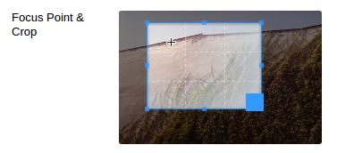
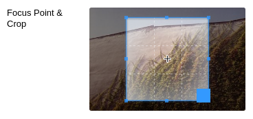

# FocusPointCropper: (Even) Smarter Image Cropping for SilverStripe

This module bolts an interface to crop an image from within the CMS, on top of Jonom's excellent FocusPoint module.
This facilitates setting an initial crop of an image, which will be used as the basis for FocusPoint's smarter cropping.



Set crop & zoom level (drag/scroll) and FocusPoint (click)

## Requirements

SilverStripe 3.3+

### Install / Composer

composer require "micschk/silverstripe-focuspointcrop" "dev-master"

## Basic usage

When you edit an image in the CMS there should be an extra 'Focus Point + Crop' field.
Scroll on the image to zoom, drag the image and (depending on configuration) resize the selection to set the crop area.
Click on the subject of the image to set the focus area and save the image.

## Config

Config options can be set using the SilverStripe Config API and will be fed directly to the js cropperfield.
Options can be set globally or per field instance.

Settable options: https://github.com/fengyuanchen/cropper/blob/v2.3.0/README.md#options

### Config example

Restrain the aspect-ratio to be square and set the initial crop to 80% of the image for a specific page in the CMS;

```php
public function getCMSFields(){
	...
	// Set custom config on FocusCropField for this instance
	Config::inst()->update('FocusPointCropField', 'cropconfig', array(
        'aspectRatio' => 1,
        'autoCropArea' => 0.8,
    ));
    ...
}
```



(the image will need to be saved first, for the crop to actually be applied)

### Further Usage

Check the original [Silverstripe FocusPoint Module](https://github.com/jonom/silverstripe-focuspoint)