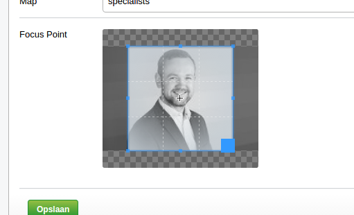

# FocusPointCropper: (Even) Smarter Image Cropping for SilverStripe

This module bolts an interface to crop an image from within the CMS, on top of Jonom's excellent FocusPoint module.
This facilitates setting an initial crop of an image, which will be used as the basis for FocusPoint's smarter cropping.

## Requirements

SilverStripe 3.3+

### Install / Composer

composer require "micschk/silverstripe-focuspointcrop" "dev-master"

## Basic usage

When you edit an image in the CMS there should be an extra 'Focus Point + Crop' field.
Scroll on the image to zoom, drag the image and (depending on configuration) resize the selection to set the crop area.
Click on the subject of the image to set the focus area and save the image.

## Todo:

- Make FocusPointCropField::setOptions() easily callable from within Page::getCMSFields()
- Settable options: https://github.com/fengyuanchen/cropper/blob/v2.3.0/README.md#options

### Further Usage

Check the original [Silverstripe FocusPoint Module](https://github.com/jonom/silverstripe-focuspoint)